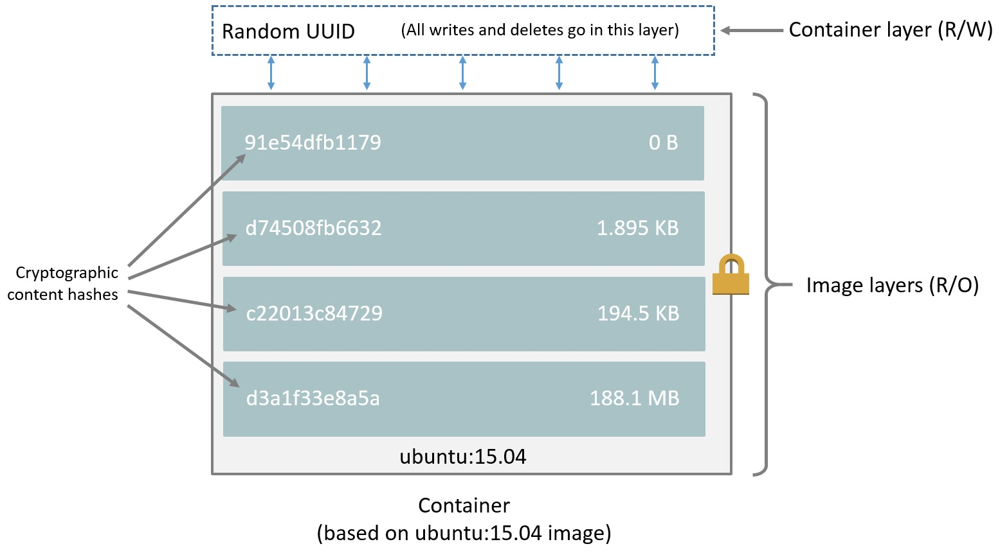
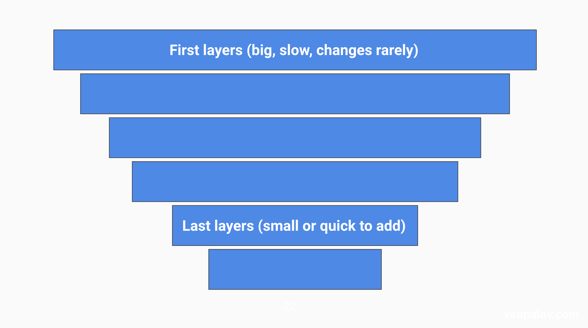

This file is used to record some ideas and insights while making base images. 
# Basic knowledge of docker images
## Layers
Docker images can be simply treated as Docker building blocks and consist of layers and each layer is an image it self without a human-assigned tag. So basically, a docker image looks like the following graph:

Following are some basic concepts of the layers:
- Each layer is an image itself, just one without a human-assigned tag. They have auto-generated IDs though.
- Each layer stores the changes compared to the image it’s based on.
- An image can consist of a single layer (that’s often the case when the squash command was used).
- Each instruction in a Dockerfile results in a layer. (Except for multi-stage builds, where usually only the layers in the final image are pushed, or when an image is squashed to a single layer).
- Layers are used to avoid transferring redundant information and skip build steps which have not changed (according to the Docker cache).
## Some insight about docker image
[This blog](https://vsupalov.com/whats-a-docker-image/) explained in detail about what exactly a docker image is. In short, a docker image is basically a diff which contains information on what changed on the image it's based on. And each image has a parent (well, apart from those based on scratch) it refers to.
## Dockerfile
A dockerfile consists of a series of instructions, and each RUN or ENV or COPY will result in a new image layer/intermediate image/image being created. As introduced before, each layer is an image itself, therefore, a container can be runned on any single layer with its ID. \
Also, the layers can be squashed. This operation can reduce a chain of images to a single image. It takes all changes and sums them up into a single image.
## Some Tips to reduce the size of docker images and speed up docker image build
In the above sections, some concepts were introduced. According to those concepts, there are some little tricks to reduce build time and image size.
### 1. Avoid docker commit 
By using 
```shell
docker commit [OPTIONS] CONTAINER [REPOSITORY[:TAG]]
```
a container can be packaged into another docker image. Using this operation will make the docker image seriously inflated (an 8g docker became 102g after several commits). Therefore, avoid rebuilds as much as possible will keep iterations short and avoid busy waiting.

### 2. Structure Docker file
Structure Dockerfile instructions like an invertes pyramid. As stated above, each instruction in Dockerfile results in an image layer being created. In addition, docker uses layers to reuse work, and save bandwidth. Following graph shows the main idea to design Dockerfiles

In practical, we use 2 Dockerfile to build docker, a base image Dockerfile which corresponds to the upper part of the pyramid and a daily Dockerfile which corresponds to the lower part of the pyramid.

### 3. Only copy files which are needed for the next step
Imagine we have the following Dockerfile snippet:
```dockerfile
RUN mkdir /code
COPY code code/
RUN pip install code/requirements.txt
```
Every time anything within the code directory changes, the second line would need to run again, and every following line as well.

That’s a pitty, because the third line only depends on one single file from the code directory: requirements.txt. Here’s how we could avoid re-running the install step on every code change:
```dockerfile
RUN mkdir /code
COPY code/requirements.txt code/
RUN pip install code/requirements.txt
COPY code /code
```
Now, the third line would only run if the file in question changes. Dependencies tend to change infrequently, so that’ll shave off a lot of unnecessary effort from the image build.

If you COPYing files, try to do so selectively. Only add the ones to the image which are needed in the next steps. You can add everything else “on top” as in the second example.

### 4. Download less stuff
When building docker images, it usually takes a long time downloading dependencies. Checking whether all the dependencies are really required seems to be a straightforward way to reduce building time and make failing cases.

One more thing to keep in mind, is the default behaviour of your OS-level package manager. For examle, apt which is used on Ubuntu and Debian, installs “recommended” packages by default. Those are packages you don’t specify (or need) explicitly, but which are installed nevertheless because you might want to have them.

You can avoid this, by adding the --no-install-recommends flag like this:
```bash
apt-get install -yqq --no-install-recommends $YOUR_PACKAGES
```
This way, you will only get the packages you asked for and their necessary requirements, reducing the download and installation time while building your Docker image.